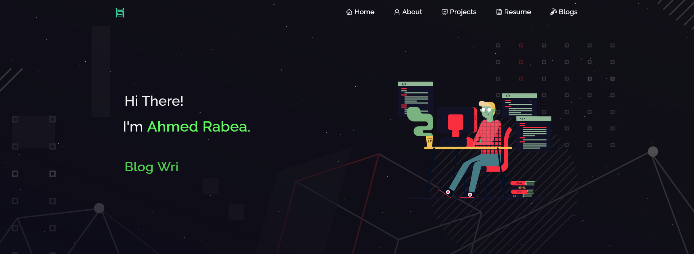

# Landing-Page

# Simple Landing Page (CSS & HTML)
This is a basic landing page created using only HTML and CSS. It provides a clean and straightforward design to showcase your content effectively.



## Features

- Clean and minimalistic design for a visually pleasing landing page.
- Easily customizable styles using CSS classes and selectors.
- Well-structured HTML code for easy content integration.

## Getting Started

To use this landing page template, follow these steps:

1. Download or clone the repository.
2. Open the `index.html` file in your preferred text editor.
3. Customize the content by replacing the placeholder text and images with your own.
4. Modify the styles in the included CSS file (`style.css`) to match your desired look and feel.
5. Save the changes and open the `index.html` file in your web browser to view the landing page.

## Folder Structure

The folder structure of this project is as follows:

```
├── index.html
└── styles.css
```

- `index.html`: The main HTML file that contains the structure and content of the landing page.
- `styles.css`: The CSS file that defines the styles for the landing page.

## Browser Compatibility

This landing page is designed to be compatible with modern web browsers. It is recommended to test it across different browsers and versions for optimal results.

## Credits

- Background images by [Unsplash](https://unsplash.com/)

## License

This project is licensed under the [MIT License](LICENSE). Feel free to modify and use it for personal and commercial projects.

Enjoy using this simple landing page template for your projects! Feel free to customize and enhance it according to your needs.